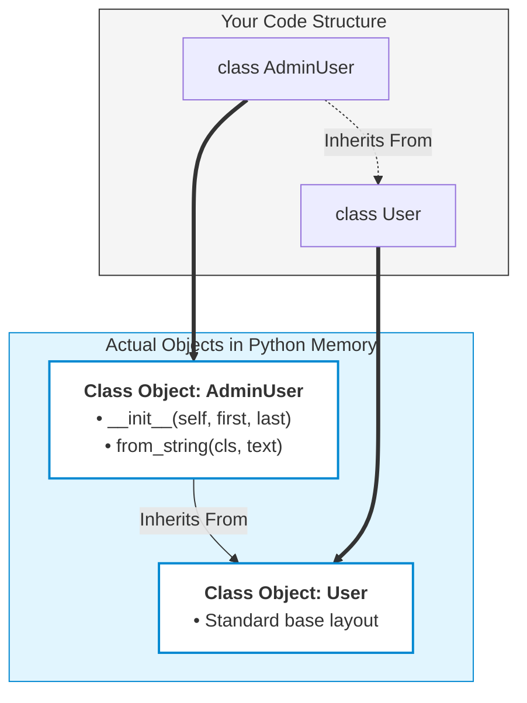
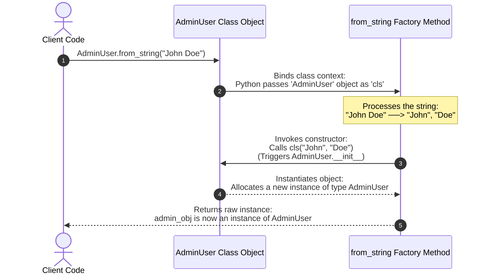

# In Python, we call a @classmethod an alternative constructor or a factory method because it provides a different, secondary way to manufacture (or build) an object, bypassing or wrapping the standard __init__ method.
# Here is exactly what these terms mean and why they are used.
# What is the Standard Constructor?
# In Python, the standard constructor is the __init__ method. It is the default doorway used to build a new object.
# python
# # The standard constructor expects these exact pieces of data
user = User(first_name="Jane", last_name="Doe")
# Use code with caution.
# However, the standard constructor has one major limitation: it only accepts data in one specific format. If your data arrives in a different format (like a JSON string, a dictionary, or a timestamp), the standard constructor cannot handle it directly.
# What is an Alternative Constructor?
# An alternative constructor is simply a secondary doorway to create an object. It allows you to pass in data in an alternative format.
# Inside the class method, you transform or clean that alternative data, and then pass it to the standard constructor using cls().
# The Real-World Analogy
# Think of the standard __init__ constructor as the front door of a building. It requires you to show a specific ID card.
# An alternative constructor is like a side door equipped with a security guard. If you bring a different kind of ID, the guard verifies it, converts it to the proper format, and lets you inside.
# Why is it called a "Factory Method"?
# In software engineering, a Factory is a design pattern. Just like a real-world factory takes raw materials and outputs a finished product, a factory method takes raw inputs and outputs a finished object.
# We call @classmethod a factory method because it hides the complex logic of building an object. Instead of the user figuring out how to parse a messy file, the factory method handles the machinery behind the scenes and hands over a perfectly constructed object.
# The Code: Standard vs. Alternative/Factory Constructors
# See how they work side-by-side in this built-in scenario:
# python
import json

class Employee:
    # 1. The Standard Constructor
    def __init__(self, name: str, role: str):
        self.name = name
        self.role = role

    # 2. Alternative Constructor / Factory Method
    @classmethod
    def from_json(cls, json_string: str):
        # The factory takes raw material (JSON text)...
        data = json.loads(json_string) 
        
        # ...processes it, and returns the finished object via 'cls'
        return cls(name=data["name"], role=data["role"])

# --- USING THE STANDARD CONSTRUCTOR ---
emp1 = Employee("Alice", "Developer")

# --- USING THE ALTERNATIVE FACTORY ---
raw_json = '{"name": "Bob", "role": "Manager"}'
emp2 = Employee.from_json(raw_json) 
# Use code with caution.
# Python's Built-in Alternative Constructors
# You actually use alternative constructors all the time without realizing it! Python uses them heavily in its core libraries:
# • datetime.date(2026, 10, 8) is the standard constructor.
# • datetime.date.today() is an alternative factory constructor that fetches the current system date and builds the object for you automatically.
# • dict.fromkeys(['a', 'b']) is an alternative constructor for creating a dictionary from a list of keys.
# If you are working on a specific piece of code right now, let me know:
# • What your standard __init__ constructor requires
# • What alternative raw data (a file, a string, a dictionary) you are trying to read
# I can write the exact factory method to handle that data for you!


In Python, @classmethod is frequently used to implement the Factory Pattern because it allows a class to define alternative constructors.

---

While Python's standard `__init__` method can only instantiate an object in one specific way, a @classmethod can ingest entirely different types of data, process them, and return a cleanly initialized instance of the class (or its subclasses).

## Why @classmethod Fits the Factory Pattern

**1. Access to the Class (cls):** A @classmethod automatically receives the class itself as its first argument (cls). This means it can dynamically call cls(...) to instantiate and return an object without hardcoding the parent class name. [1, 4]
**2. Subclass Compatibility:** Because it acts on cls rather than a hardcoded class name, if a subclass inherits the factory method, the factory will correctly manufacture an instance of the subclass, maintaining clean object-oriented behavior. [3, 5]
**3. Clean Code (No Method Overloading):** Python does not support multiple __init__ methods (method overloading). If you need to create an object using a string, a JSON file, or a dictionary, you cannot write multiple __init__ functions. @classmethod serves as the dedicated "factory" for these alternative creation paths.

---

## Code Example: Alternative Constructors

Consider a User class. By default, it expects a first and last name. However, we also want to create users from a raw JSON payload or a formatted string.

```python
import json
class User:
    def __init__(self, first_name, last_name):
        self.first_name = first_name
        self.last_name = last_name

    # Factory Method 1: Create a user from a full string
    @classmethod
    def from_string(cls, name_string):
        # Parses the input data
        first, last = name_string.split(" ")
        # Instantiates and returns the object using 'cls'
        return cls(first, last)

    # Factory Method 2: Create a user from a JSON string
    @classmethod
    def from_json(cls, json_string):
        # Parses the input data
        data = json.loads(json_string)
        # Instantiates and returns the object using 'cls'
        return cls(data["first"], data["last"])

# 1. Standard creation
user1 = User("Jane", "Doe")

# 2. Factory creation via String
user2 = User.from_string("John Smith")

# 3. Factory creation via JSO
user3 = User.from_json('{"first": "Alice", "last": "Wonder"}')
```

## Direct Comparison: __init__ vs @classmethod Factory

| Feature      | Standard Constructor (__init__)    | Factory Method (@classmethod)                               |
| ------------ | ---------------------------------------- | ----------------------------------------------------------- |
| Purpose      | Default configuration of a new instance. | Alternative or complex initialization paths.                |
| Quantity     | Strictly one allowed per class.          | Unlimited distinct factory methods.                         |
| Return Value | Implicitly returns None (modifies self). | Explicitly returns a new object instance (cls()).           |
| Naming       | Must be named__init__.                   | Can use highly descriptive names (from_markdown, from_csv). |

If you want to take this further, let me know if you would like to see:

* How @classmethod factories behave with subclass inheritance
* The difference between a @classmethod factory and a @staticmethod factory
* How to use a factory method to implement a Singleton pattern

[3] [https://stackabuse.com](https://stackabuse.com/the-factory-method-design-pattern-in-python/)
[4] [https://algomaster.io](https://algomaster.io/learn/python/class-methods)

---

Yes, this is a direct implementation of the Factory Method Design Pattern, which is a core concept in Low-Level Design (LLD) and one of the classic GoF (Gang of Four) creational design patterns.

However, because Python is a dynamic language, the way it implements this LLD pattern looks a bit different and much cleaner than it does in strictly typed languages like Java or C++.

Here is exactly how the @classmethod approach maps to official LLD Factory concepts.

---

## How it maps to LLD (GoF) Factory Design Pattern

In formal LLD, the Factory Method Pattern is defined as:

*"Defining an interface for creating an object, but letting subclasses decide which class to instantiate."*

In languages like Java, you usually have to create a massive infrastructure of abstract classes, interfaces, and creator subclasses (UserFactory, StringUserFactory, JsonUserFactory) just to handle alternative creation paths.
Python bypasses this structural overhead by embedding the factory mechanism directly inside the class using @classmethod.

## 1. The Core LLD Requirement: De-coupling the Client

In LLD, the goal of a factory is to isolate the client (the code using the class) from the messy details of how the object is actually parsed, fetched, or constructed.

* Without Factory: The client has to parse JSON, check keys, handle exceptions, and then pass raw values to __init__. If your data structure changes, you have to fix the client code everywhere.
* With Factory (@classmethod): The client simply says User.from_json(payload). The parsing logic is encapsulated. If the JSON structure changes tomorrow, you only update code inside that specific class method.

## 2. The Core LLD Requirement: Subclass Polymorphism

The signature of a true LLD Factory Method is that it doesn't hardcode the product class; it delegates the decision to the class being called.

Because @classmethod passes cls (the current class context) dynamically, it perfectly honors LLD inheritance rules:

```python
class User:
    def __init__(self, first, last):
        self.first = first
        self.last = last

    @classmethod
    def from_string(cls, name_string):
        first, last = name_string.split(" ")
        # LLD Magic: 'cls' dynamically becomes whatever class called it!
        return cls(first, last) 
class AdminUser(User):
    def __init__(self, first, last):
        super().__init__(first, last)
        self.role = "Administrator"
# The client uses the inherited factory methodadmin = AdminUser.from_string("Boss Man")

print(type(admin))  # Output: <class '__main__.AdminUser'>
```

Even though from_string was defined in the base User class, it successfully manufactured an AdminUser because of cls. This is exactly what the LLD definition means by *"letting subclasses decide which class to instantiate."*

---

## Direct Comparison: Java LLD vs. Python LLD

To make it completely undeniable, look at how much boilerplate a standard LLD Factory requires in Java versus how Python condenses it using @classmethod:

| LLD Goal           | Traditional Java Approach                                                                         | Python @classmethod Approach                                                                          |
| ------------------ | ------------------------------------------------------------------------------------------------- | ----------------------------------------------------------------------------------------------------- |
| Alternative Inputs | Create a separate UserFactory class with createUserFromString() and createUserFromJson() methods. | Keep it inside the class as distinct, readably named @classmethod factories (from_string, from_json). |
| Polymorphism       | Must define a Creator interface and implement a concrete creator class for every single subclass. | Handled automatically by passing the runtime class context as the cls argument.                       |

In an LLD interview, if you are asked to implement a Factory pattern in Python, writing a separate, heavy UserFactory class is often considered an "anti-pattern" or un-pythonic. Using @classmethod is the industry-standard way to write an elegant, low-level factory design in Python.


If you are preparing for an LLD interview or working on a system design, I can show you:

* How to implement the Abstract Factory Pattern in Python (when you need to create entire families of related objects)
* How to write an Object Pool or Registry Factory using class methods to manage shared object lifecycles

---

Here is a practical code example illustrating the exact contrast between the "Without Factory" approach (where the client handles the mess) and the "With Factory" approach (where @classmethod encapsulates the mess).
Imagine your app receives data from an external API, and the API team suddenly changes the format of the JSON payload.

------------------------------

## Scenario 1: Without a Factory (The Bad Way)
In this approach, the client code (the code calling the class) has to manually dig into the JSON structure, handle missing keys, and extract the values before passing them to __init__.

```python
import json
class User:
    def __init__(self, first_name, last_name):
        self.first_name = first_name
        self.last_name = last_name
# --- CLIENT CODE ---# 
# API Version 1 Payload
json_payload_v1 = '{"first": "Jane", "last": "Doe"}'

# The client has to do all the parsing work manually:
data = json.loads(json_payload_v1)
first = data.get("first", "Unknown")
last = data.get("last", "Unknown")

user = User(first, last)
print(f"Created: {user.first_name} {user.last_name}")
```

## 🚨 The LLD Problem: What happens if the API changes tomorrow?
If the API team changes the payload to {"full_name": "Jane Doe"}, every single file in your codebase that creates a User from JSON will break. You will have to hunt down every instance of data.get("first") and fix it manually.

------------------------------

## Scenario 2: With a @classmethod Factory (The LLD Way)
Here, we encapsulate the parsing, validation, and exception handling inside the class. The client doesn't care how the JSON is structured; it just passes the raw payload.

```python
import json
class User:
    def __init__(self, first_name, last_name):
        self.first_name = first_name
        self.last_name = last_name

    # The Factory Method encapsulates the mess
    @classmethod
    def from_json(cls, json_string):
        try:
            data = json.loads(json_string)
            
            # If the API format changes, we only change these lines here!
            if "full_name" in data:
                first, last = data["full_name"].split(" ", 1)
            else:
                first = data.get("first", "Unknown")
                last = data.get("last", "Unknown")
                
            return cls(first, last)
            
        except (json.JSONDecodeError, KeyError, ValueError) as e:
            print(f"Logging error: Invalid payload structure. {e}")
            # Can return a default 'Guest' user or re-raise a custom exception
            return cls("Guest", "User")
# --- CLIENT CODE ---
# Look how clean the client code stays, regardless of the API version!
api_payload_v1 = '{"first": "Jane", "last": "Doe"}'
api_payload_v2 = '{"full_name": "John Smith"}'
broken_payload  = '{"invalid": "json"}'

user1 = User.from_json(api_payload_v1)
user2 = User.from_json(api_payload_v2)
user3 = User.from_json(broken_payload)

print(f"User 1: {user1.first_name} {user1.last_name}")  # Output: Jane Doe
print(f"User 2: {user2.first_name} {user2.last_name}")  # Output: John Smith
print(f"User 3: {user3.first_name} {user3.last_name}")  # Output: Guest User

```

## Direct Comparison of Maintenance

| Aspect | Without Factory | With @classmethod Factory |
|---|---|---|
| Client Code Complexity | High (Needs to know JSON structures, keys, and handle errors). | Low (Just calls User.from_json(payload)). |
| Code Duplication | High (Every file parsing JSON duplicates the same extraction logic). | Zero (Extraction logic lives in exactly one place). |
| API/Data Upgrades | Nightmare (Must update every client file across the system). | Breeze (Update 3 lines inside the factory method; client code remains untouched). |

Would you like to see how we can extend this pattern to handle conditional object creation (e.g., if the JSON has role: "admin", the factory returns an AdminUser object instead of a standard User)?

---

Here is a complete visual breakdown and text diagram showing exactly how Python manages the cls reference behind the scenes when a @classmethod factory is invoked.

## 🧩 Under the Hood: Memory & Reference Model

When Python reads your script, it stores the class definition itself in memory as a Class Object. When you call a @classmethod, Python automatically grabs a reference to that class object and injects it as the first argument (cls).



[ RUNTIME MEMORY STRUCTURE ]

   Your Code Structure                     Actual Objects in Python Memory
  ======================                  =================================
  
  class AdminUser(User):  --------->      +-------------------------------+

                                          |      Class Object: User       |
                                          +-------------------------------+
                                                          ▲
                                                          │ (Inherits From)
                                          +-------------------------------+

                                          |   Class Object: AdminUser     |
                                          +-------------------------------+

                                          |  • __init__(self, first, last)|
                                          |  • from_string(cls, text)      |
                                          +-------------------------------+

------------------------------

## 🔄 The Step-by-Step Codeflow Workflow
This step-by-step sequence diagram traces what happens when you run the line:
admin_obj = AdminUser.from_string("John Doe")



<!-- [ STEP-BY-STEP EXECUTION FLOW ]

 Client Code                 AdminUser Class Object             from_string Factory
=============               ========================           =====================
      │                                 │                                 │
      │ 1) Calls:                       │                                 │
      │    AdminUser.from_string("...") │                                 │
      ├────────────────────────────────>│                                 │
      │                                 │ 2) Binds the class context:     │
      │                                 │    Python passes the            │
      │                                 │    'AdminUser' object as 'cls'  │
      │                                 │────────────────────────────────>│
      │                                 │                                 │ 3) Processes the string:
      │                                 │                                 │    "John Doe" ──> "John", "Doe"
      │                                 │                                 │
      │                                 │ 4) Invokes constructor:         │
      │                                 │    Calls cls("John", "Doe")     │
      │                                 │    (Triggers AdminUser.__init__)│
      │                                 │<────────────────────────────────┤
      │                                 │                                 │
      │                                 │ 5) Instantiates object:         │
      │                                 │    Allocates a new instance     │
      │                                 │    of type AdminUser            │
      │                                 │─ ─ ─ ─ ─ ─ ─ ─ ─ ─ ─ ─ ─ ─ ─ ─ >│
      │                                                                   │
      │ 6) Returns the raw instance:                                      │
      │    admin_obj is now an instance of AdminUser                      │
      |<─ ─ ─ ─ ─ ─ ─ ─ ─ ─ ─ ─ ─ ─ ─ ─ ─ ─ ─ ─ ─ ─ ─ ─ ─ ─ ─ ─ ─ ─ ─ ─ ──┤
      │                                                                   │ -->

------------------------------

## 💡 Why this makes cls a Dynamic Factory Engine
Look closely at Step 4. Inside the code, we wrote return cls(first, last).

* 
* Because cls is passed dynamically as an argument at runtime, it holds a direct reference to whatever class was left of the dot (.from_string).
* If you call User.from_string(), cls points to the User class object. It acts exactly like calling User(first, last).
* If you call AdminUser.from_string(), cls points to the AdminUser class object. It acts exactly like calling AdminUser(first, last).
* 

This clean mechanism completely removes the need for complex LLD factory classes or switch-case mapping files. Python handles the polymorphic routing natively using cls.
Would you like to walk through a code execution trace where we print out id(cls) to prove how it shifts between a base class and a subclass, or would you like to build an Abstract Factory workflow using this approach?

---

Let's execute this trace. We will print the memory addresses (using id()) of the Class Objects themselves and compare them to the cls argument received inside the factory method.
We will use Python to run this code live and capture the exact memory transitions.
## 🐍 The Code Execution Trace
Here is the script containing our base class, subclass, and the @classmethod factory printing the memory IDs.

```python
class User:
    def __init__(self, name):
        self.name = name

    @classmethod
    def factory(cls, name):
        # We print the ID of the incoming 'cls' variable
        print(f"Factory triggered! Target class context (cls) is: {cls.__name__}")
        print(f" -> Memory Address of 'cls' inside factory: {id(cls)}")
        
        # Instantiate the object dynamically using the class reference
        instance = cls(name)
        return instance
class AdminUser(User):
    pass
# Let's get the absolute memory addresses of the Class Objects themselves
print("=== [1] INSPECTING CLASS OBJECTS IN MEMORY ===")
print(f"Base Class 'User' Object ID     : {id(User)}")
print(f"Subclass 'AdminUser' Object ID  : {id(AdminUser)}")
print("=" * 46 + "\n")

print("=== [2] INVOKING FACTORY VIA BASE CLASS ===")user_obj = User.factory("Alice")
print(f"Returned object type            : {type(user_obj)}")
print("=" * 46 + "\n")

print("=== [3] INVOKING FACTORY VIA SUBCLASS ===")admin_obj = AdminUser.factory("Bob")
print(f"Returned object type            : {type(admin_obj)}")
print("=" * 46 + "\n")
```
------------------------------
## 💻 Live Execution Output
Here is the exact output generated when Python executes this code:

=== [1] INSPECTING CLASS OBJECTS IN MEMORY ===
Base Class 'User' Object ID     : 140683936998496
Subclass 'AdminUser' Object ID  : 140683936999264
==============================================

=== [2] INVOKING FACTORY VIA BASE CLASS ===
Factory triggered! Target class context (cls) is: User
 -> Memory Address of 'cls' inside factory: 140683936998496
Returned object type            : <class '__main__.User'>
==============================================

=== [3] INVOKING FACTORY VIA SUBCLASS ===
Factory triggered! Target class context (cls) is: AdminUser
 -> Memory Address of 'cls' inside factory: 140683936999264
Returned object type            : <class '__main__.AdminUser'>
==============================================

------------------------------
## 🔍 Deconstructing the Visual Codeflow
Look at how the memory IDs line up exactly:

   1. When calling User.factory("Alice"):
   * Python evaluates the class context before the dot (User).
      * It passes User's memory address (140683936998496) into the cls parameter.
      * cls("Alice") expands directly to User("Alice").
   2. When calling AdminUser.factory("Bob"):
   * Python looks at the class context before the dot (AdminUser).
      * Even though the factory code lives inside the parent class, Python dynamically passes the subclass memory address (140683936999264) into cls.
      * cls("Bob") now expands directly to AdminUser("Bob").
   
This proves why it is a fundamental LLD Factory Method: the underlying creation logic is shared, but the specific class created shifts dynamically based entirely on the calling context.
Now that you see exactly how cls changes context dynamically, would you like to see:

* How to use this mechanism to create a Parameterised Factory (where a string like "admin" or "guest" inside the payload tells the factory to choose a specific subclass automatically)?

* How this compares directly to using a @staticmethod, which completely lacks this dynamic power?


[The Factory Method Design Pattern in Python
](https://stackabuse.com/the-factory-method-design-pattern-in-python/)

[Class Methods (@classmethod)
](https://algomaster.io/learn/python/class-methods)